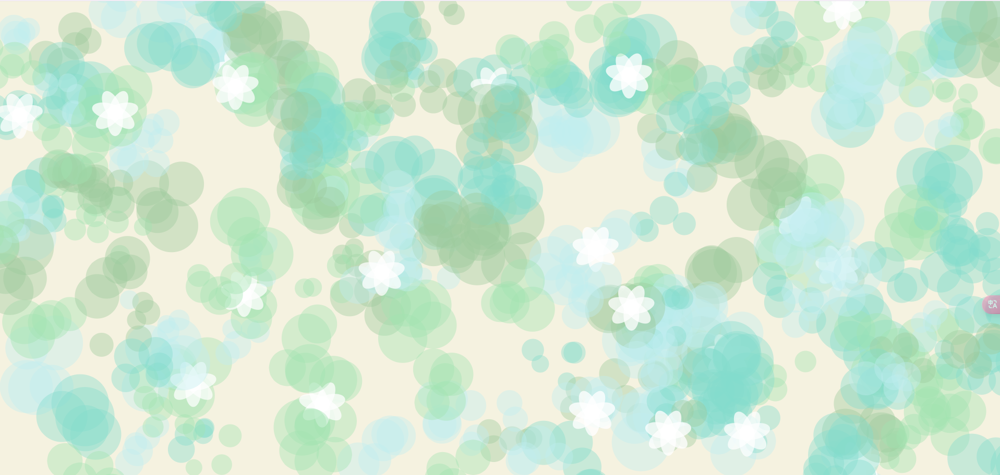

# HW10
## HW10A
The Chinese name of the music I chose is *counting stars*, and the English definition is counting stars. 
So I want to achieve a similar effect of the starry sky in the job HW10A.

- **The particle colour is associated with the volume**:
The higher the volume, the brighter the particles are, and the colour transitions from white to yellow.

- **Number of particles correlates with frequency**:
The energy of the high frequency part determines the density of the particles.

- **Dynamic particle effect**:
Particles disappear over time and new particles are created.

- Add P5.sound library link:

## HW10B
- **Demo**:

- **Background music**: I learnt the guzheng, a classical Chinese traditional instrument, for many years when I was a child. I chose one of my favourite tunes, ‘Jasmine Fragrance’.

- **Cloud dispersion**:
Cloud locations are randomised and each cloud consists of multiple layers of randomly sized ovals stacked on top of each other for an overall more natural look.

- **Random Colour and Size**:
Cloud colours are randomly selected among the 4 specified colours, with randomness in size and transparency.

- **Flowers**:
Jasmine flowers are white.

- **Overall picture**:
Flowers and clouds are combined to create a natural and Chinese style image. The background colour is similar to Chinese rice paper.
